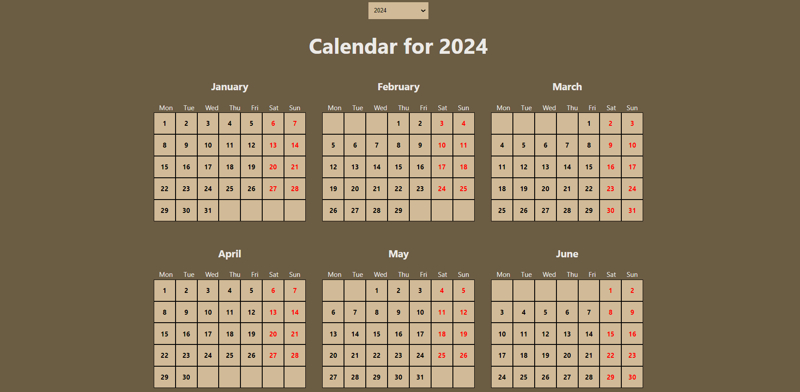

# Calendar

### About:
A calendar application built using a component-based approach, including Year, Month, Week, and Day components. It constructs the calendar based on the first day of the year. Additionally, a select option is provided for users to choose the desired year.

### Demo:

### Technologies Used:

